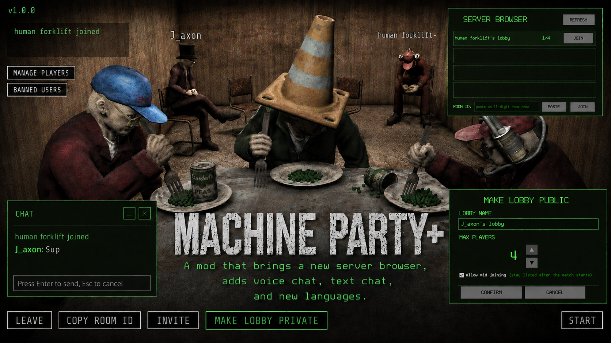
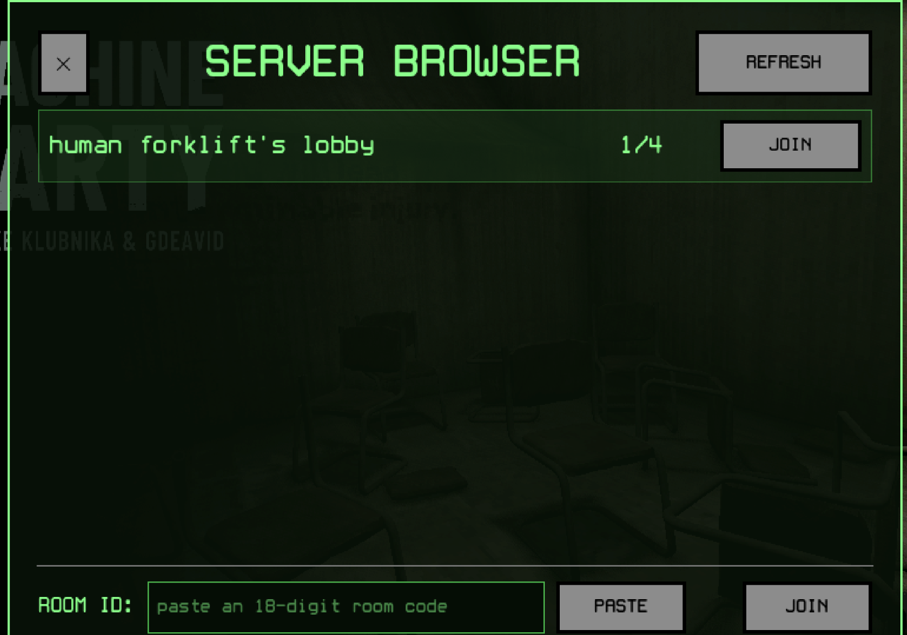
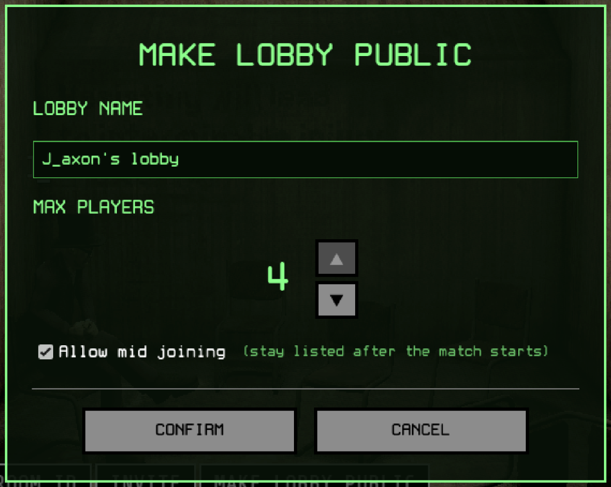
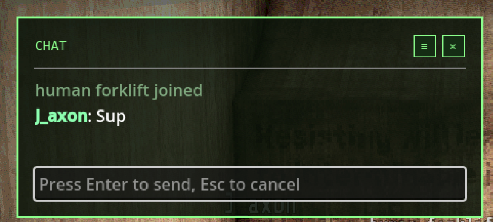

<h1 align="center">MachineParty+</h1>

<p align="center">
  
</p>

**MachineParty+ is an all-in-one community mod for Machine Party.** It adds a global server browser, voice chat, text chat, player moderation (kick / ban), a live in-match scoreboard, and full translations into every language the game ships with, plus Arabic.

Everything is built on top of the game's own Steam networking and is styled with the game's own fonts and a green terminal theme, so it fits right in. It does **not** repack or modify the game's data files. It only adds to them.

Created by **J_axon** and **Krunk**.

> **Credit required.** You are free to use MachineParty+'s code in your own projects under the MIT License. If you reuse any of it, you must credit **J_axon** and **Krunk** and keep the license notice included. Please keep that credit visible and easy to find, for example in your README, mod description, or in-game credits.

---

## Features

- **Server browser** — a worldwide, non region-locked list of public lobbies, in place of the main-menu JOIN button.
- **Host a public lobby** — a "Make Lobby Public" toggle (private by default), with a popup to name your lobby, set a max player count (up to 4), and choose whether people can join mid-match.
- **Join by room code** — paste the game's normal 18-digit room ID to join a private lobby directly.
- **Voice chat** — proximity-free party voice built on Steam P2P, with mute, deafen, and per-player volume, plus a device picker (choose your mic and speakers) that saves between sessions.
- **Text chat** — a lightweight chat box (press **T**) with a smart profanity filter, per-player mute, and join / leave notices.
- **Manage Players** — mute or set the volume of anyone in the lobby. Hosts also get **Kick** and **Ban** (with a confirmation prompt).
- **Banned Users** — a persistent, Steam-ID-based ban list. Banned players are auto-removed and cannot see or rejoin your lobbies until you unban them.
- **Mutation scoreboard** — hold **Tab** during a match to see everyone's live mutation score and how many rounds they've won and lost.
- **Translations** — the whole mod UI follows the game's language setting. Every game language is supported, plus **Arabic**, with more polish and languages to come.

MachineParty+ is a pure GDScript mod loaded through the **[Machine Party Mod Loader](https://github.com/Krunk-theduck/MachinePartyModLoader)**.

---

## How it works

Machine Party already runs on Steam lobbies, but every lobby the base game creates is friends-only, so lobbies never show up in a public search. MachineParty+ changes that in a safe, additive way:

- When you make your lobby public, the mod flips your existing Steam lobby to a public type and tags it with a little lobby data (name, max players, game version, host name). Turning it private again restores the friends-only default.
- The browser asks Steam for a worldwide list of lobbies carrying that public tag and reads each one's data to show its name and player count.
- Joining a lobby reuses the game's own client join flow, the exact same path used when you accept a Steam invite. Nothing about the underlying connection changes.
- Voice and text chat, kick/ban messages, and moderation all ride on Steam's peer-to-peer messaging alongside the game's own networking.

---

## Works with vanilla players

MachineParty+ is fully cross-compatible with players who do **not** have the mod. You do not both need it installed to play together.

- If you host with the mod active, you can still give your room ID code to a vanilla player and they can join and play with you completely normally.
- It works the same the other way around: with the mod, you can paste a vanilla host's room ID code and join their game just fine.
- Public lobbies only appear in the browser for people who also have the mod, but anyone can still join by room ID code.

The only difference for mod players is that the in-game **Invite** button does not work (a Steam overlay limitation of the mod loader), so mod players just share the room ID code instead. Voice and text chat only reach other players who also have the mod.

---

## Controls and how everything works

MachineParty+ adds its own buttons around the game. Because the game only has room for so many buttons at once, some of them **move depending on where you are** (main menu, in the lobby, or in a match). Here is exactly where everything lives.

### On the main menu

- **JOIN** opens the **server browser** (screenshot below).
- Two extra native-styled buttons are added next to the others:
  - **BANNED USERS** — view your ban list and unban anyone.
  - **VOICE SETTINGS** — pick your microphone and speakers. Your choice is saved and reapplied every launch.

### The server browser

<p align="center">
  
</p>

- A live list of public lobbies from around the world, each showing the lobby name and current players out of the max.
- **REFRESH** (top right) re-fetches the list at any time.
- A lobby's **JOIN** button joins it. Full or version-mismatched lobbies are shown but can't be joined.
- **ROOM ID** field (bottom): paste an 18-digit room code and press **JOIN** to join a private lobby directly. **PASTE** fills the field from your clipboard.
- **✕** (top left) closes the browser.

### In the lobby

**Make Lobby Public (host only).** In the lobby's normal button row you get a **MAKE LOBBY PUBLIC** button in the game's native style. Press it to open the setup popup:

<p align="center">
  
</p>

- Type a **lobby name**.
- Set **max players** with the up/down arrows (capped at 4).
- Toggle **Allow mid joining** — when on, your lobby stays listed after the match starts; when off, it drops off the browser once the match begins or the lobby is full, and reappears when a slot opens.
- **CONFIRM** publishes it. The same button now reads **MAKE LOBBY PRIVATE**, so pressing it again flips you back to private. It is a simple on/off switch.

**Side buttons (a small strip on the left of the lobby screen).**

- **MANAGE PLAYERS** — available to **everyone**. Opens a live list of players; mute anyone or set their per-player volume. Hosts additionally see **Kick** and **Ban** on each player.
- **BANNED USERS** — **host only**. Opens your ban list to review or unban.

These are styled to match the game's buttons, just a little smaller so they tuck to the side and out of the way.

**Voice mute / deafen.** Two buttons float in the **top-right** corner while you're in the lobby:

- **MUTE MIC** — others can't hear you; you still hear them.
- **DEAFEN** — you hear no one and no one hears you.

They hide automatically whenever a menu or popup is open.

### In a match

To keep the play area clean, the lobby's extra buttons **move into the pause (Esc) menu** once a match starts:

- Press **Esc** and you'll find **Manage Players** (everyone), **Banned Users** (host), **Mute Mic**, and **Deafen** added to the pause menu in its native style.
- The floating mute/deafen and the side strip disappear during gameplay, because they now live in the Esc menu.

### Mutation scoreboard

- **Hold Tab** during a match to bring up the scoreboard: every player, their live **mutation** score, and how many rounds they've **won** and **lost**.
- It never grabs your mouse, so you keep playing normally while it's up. Mid-game joiners are added, players who leave drop off, and rejoiners keep the score they left with (just like the base game).

### Kick and Ban

- Open **Manage Players** (host), pick a player, and choose **Kick** or **Ban**.
- A **confirmation prompt** appears first so you never remove someone by accident.
  - **Kick** removes them from the current lobby (they can rejoin).
  - **Ban** removes them and blocks them from seeing or rejoining any lobby you host, until you unban them from **Banned Users**.

### Text chat

<p align="center">
  
</p>

- Press **T** in the lobby or a match to open chat. Type a message and press **Enter** to send, **Esc** to cancel.
- A smart profanity filter (local only, toggleable in the chat options) censors slurs and swearing, including padded and misspelled variants.
- You can mute individual players in chat, and joins / leaves are announced.

### Languages

- The entire mod UI, server browser and chat included, follows whatever language you set in Machine Party's own options. Change the game's language and MachineParty+ changes with it.
- **Every language the game ships with is supported, plus Arabic.** These are community translations, so more polish and additional coverage will come over time.

---

## Installation

MachineParty+ runs through the **[Machine Party Mod Loader](https://github.com/Krunk-theduck/MachinePartyModLoader)** by Krunk-theduck. You install the loader once, then drop MachineParty+ into the mods folder. Everyone who wants to browse, host, use voice/text chat, or moderate needs both. A friend can still join your private lobby by room ID code without either.

### Step 1: Install the Machine Party Mod Loader

1. **Find your game folder.** In Steam, right-click **Machine Party** in your library, choose **Manage**, then **Browse local files**. Open the **`Machine Party_Windows`** folder. It contains **`Machine Party.exe`** and **`Machine Party.pck`**.
2. **Download the loader.** Get **`MachinePartyModLoader.exe`** from the loader's releases page (extract it first if it comes as a `.zip`):
   https://github.com/Krunk-theduck/MachinePartyModLoader/releases
3. **Place the loader.** Drag **`MachinePartyModLoader.exe`** into that game folder so it sits right next to **`Machine Party.exe`** and **`Machine Party.pck`**.
4. **Run it.** Double-click **`MachinePartyModLoader.exe`**. If Windows shows a security warning, click **More info** then **Run anyway**. A command window shows the setup progress and closes when it's done. This creates a **`mods`** folder in your game directory.

### Step 2: Install MachineParty+

1. Download **`Jarunk-MachinePartyPlus.zip`** from this repo's releases page:
   https://github.com/YOUR-USERNAME/MachineParty-Plus/releases
2. Extract it into the **`mods`** folder inside your game folder, so you end up with the folder (not a zip) at:
   ```
   <your Machine Party folder>\mods\Jarunk-MachinePartyPlus\
   ```
   That folder should contain `main.gd`, `mod.json`, and the other mod files.

### Step 3: Launch and play

1. **Start Machine Party from Steam exactly like you always have.** The mod loader hooks in automatically, so there's no special shortcut.
2. To check the loader is active, press the backtick key **`` ` ``** in-game. A small debug console appears if it's working.
3. On the main menu, press **JOIN** to open the server browser. To host a public game, start a lobby and press **MAKE LOBBY PUBLIC**.

To uninstall, delete the `Jarunk-MachinePartyPlus` folder from `mods`. To play vanilla again, remove the loader (or just delete the mod folder).

### (Optional) Auto-run the loader

If you'd rather not think about it, you can set Machine Party's Steam **Launch Options** to run the loader automatically:
```
"C:\path\to\Machine Party_Windows\MachinePartyModLoader.exe" %command%
```

---

## Game updates

MachineParty+ runs on top of the Machine Party Mod Loader, so a future Machine Party update can temporarily break the loader (and with it, this mod). If that happens, mods may stop loading.

If it does, don't panic and don't keep reinstalling. Wait until the mod loader pushes an update that fixes it, then update the loader and launch again. Your normal, unmodded game is never affected.

---

## Building from source

MachineParty+ is pure GDScript, so there is no compile step. The Machine Party Mod Loader loads mods as **loose folders**, so "building" just means zipping the mod folder for release, so that extracting it into `mods` gives you `mods/Jarunk-MachinePartyPlus/`.

Requirements: git, and Python 3 (used only to package the zip).

1. Clone the repo:
   ```bash
   git clone https://github.com/YOUR-USERNAME/MachineParty-Plus.git
   cd MachineParty-Plus
   ```
2. Build the release zip:
   ```bash
   python build.py
   ```
   This writes `dist/Jarunk-MachinePartyPlus.zip`.
3. Install it for testing: extract the zip into your game's `mods` folder (so you get `mods/Jarunk-MachinePartyPlus/`), then launch Machine Party normally from Steam.

Dev loop: edit the GDScript in `Jarunk-MachinePartyPlus/`, copy the folder into the game's `mods` folder (or re-run `build.py` and extract), and relaunch.

Repo layout:

```
Jarunk-MachinePartyPlus/   the mod source (main.gd, chat_manager.gd, chat_hud.gd,
                           mod.json, mod_i18n.json, ar.json)
dist/                      the built, ready-to-install zip
assets/                    readme screenshots
build.py                   packages the mod into dist/
```

Translations live in `Jarunk-MachinePartyPlus/mod_i18n.json`, keyed by the English string, one section per language, so anyone can add or correct a translation.

---

## Credits

- Created by **J_axon** and **Krunk**.
- Loaded through the **[Machine Party Mod Loader](https://github.com/Krunk-theduck/MachinePartyModLoader)** by **Krunk-theduck**.

---

## License

MachineParty+ is released under the **MIT License**. You are free to use, modify, and include this code in any project, including your own mods, for free. The one requirement is that you keep the credit to **J_axon** and **Krunk** (the copyright and permission notice from the LICENSE file) included with the code. Please also credit both somewhere visible in any project that reuses it. See the [LICENSE](LICENSE) file for the full terms.

---

## AI disclosure

AI was used during the development of this project, mainly for revisions, inquiries, and things I just did not know. This does not mean the mod was fully AI-made, but rather that AI was used as part of the development process. I wanted to disclose this for people who may have a problem with AI being involved and may not want anything to do with it. Even though I disagree with your view on AI, I still respect your opinion on the subject.
